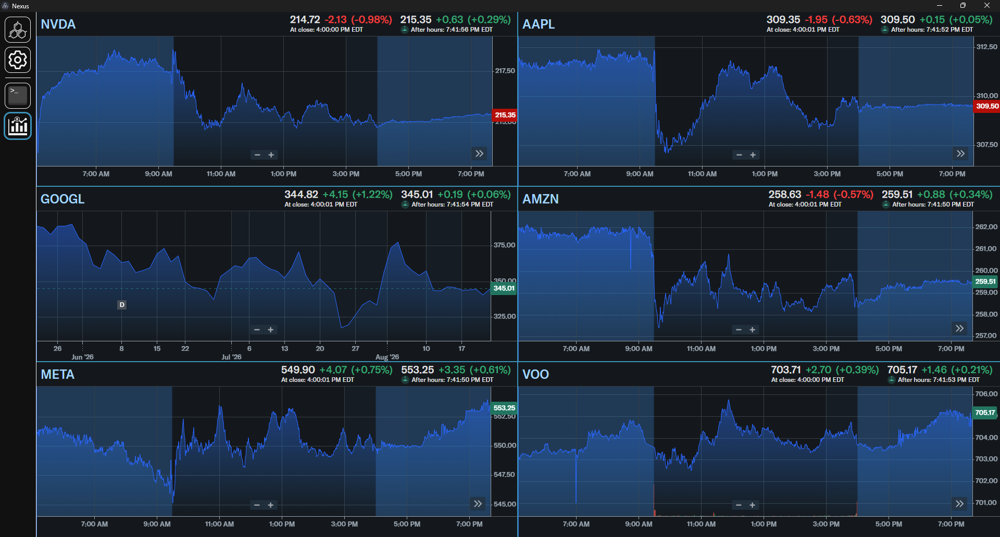
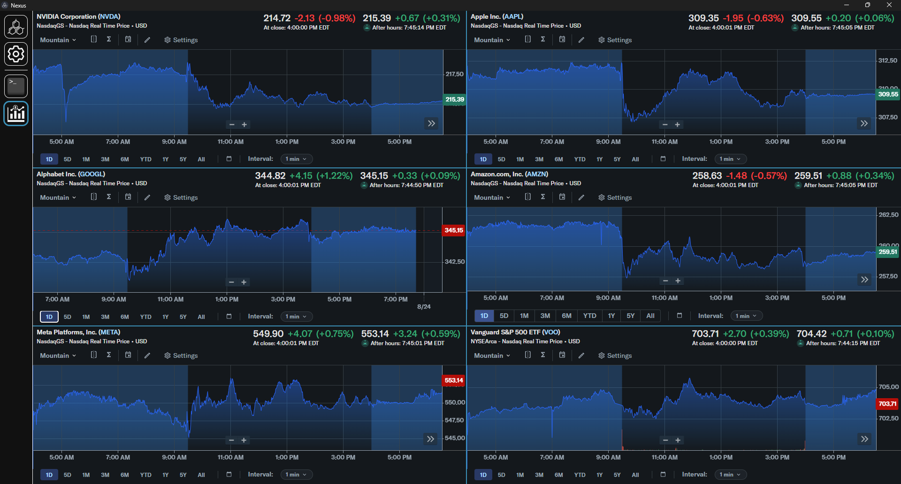
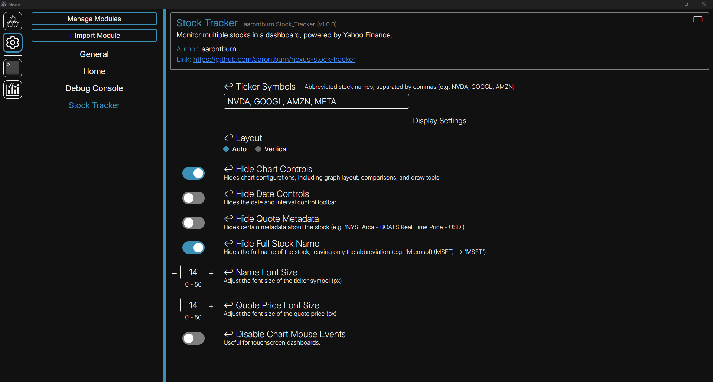

# Stock Dashboard
This is a module for Nexus that allows you to create a dashboard to view stocks. This module does not track or require any user information, including logins or stock positions. This is powered by **Yahoo! Finance**.

# Features
- **Track any stock**: Track as many stocks as you want in a clean, organized dashboard.
- **No login or user data stored**: You do not need to log in to any services to use this module, or provide any data.
- **Debloated UI**: Provides settings to toggle certain aspects of the chart that might not be relevant to you, including chart controls, quote metadata, and more.
- **Yahoo! Finance Advanced Chart Features**: While we can't take credit for this, Yahoo Finance's advanced chart comes with a wide variety of features, including stock comparisons, indicators, and drawing.

# Installation
## Automatic Installation (Recommended)
1. Install the latest release of Nexus at :
   - https://www.nexus-app.net/ or 
   - https://github.com/aarontburn/nexus-core/releases/latest
2. Visit the Chrome Remote Desktop module marketplace page and press "Install to Nexus"
3. When prompted, restart Nexus.

## Manual Installation
1. Install the latest release of Nexus at https://www.nexus-app.net/ or https://github.com/aarontburn/nexus-core/releases/latest
2. Download the latest release of the Chrome Remote Desktop module at https://github.com/aarontburn/nexus-chrome-remote-desktop/releases/latest
3. Keep the release as a `.zip`.
4. Open Nexus and navigate to the settings and press "+ Import Module"
5. Select the downloaded `.zip`
6. When prompted, restart Nexus

# Usage
1. Once installed, navigate to the `Settings > Stock Tracker`.

2. For each stock you want to monitor, add the ticker symbol (or abbreviated stock name) to the "Ticker Symbols" input field, separated by a comma.
   - Adjust any additional settings to match your preferences
3. Done! Return to the Stock Tracker module and begin watching your stocks. 
